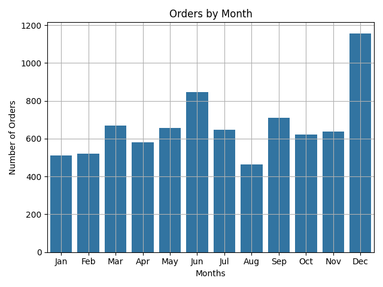
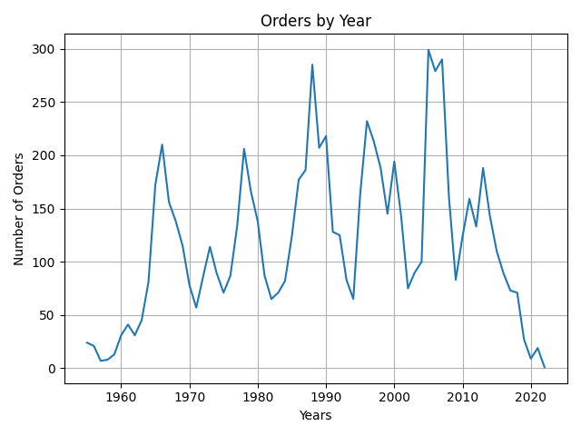
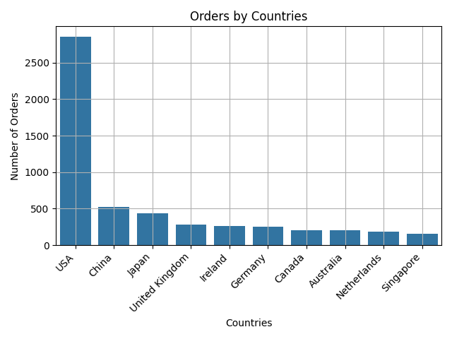
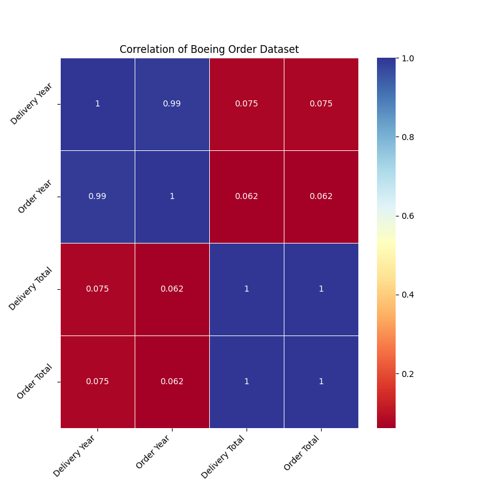
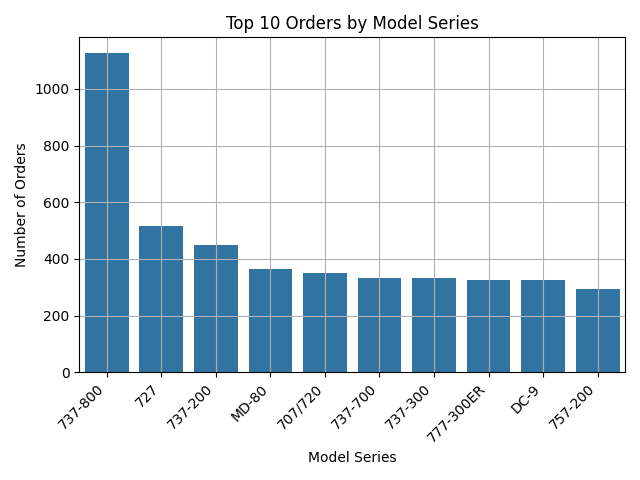
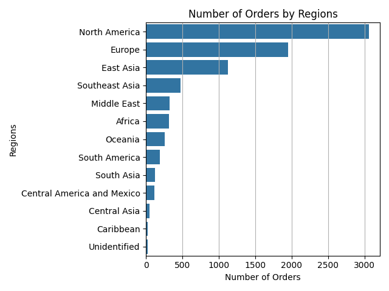
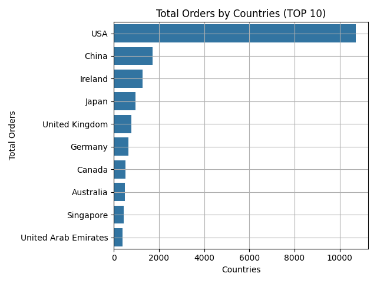
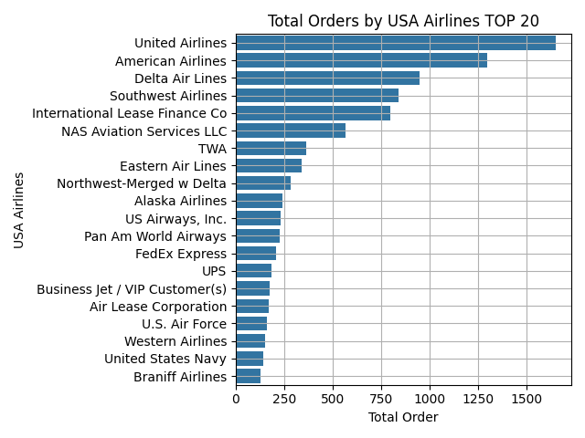
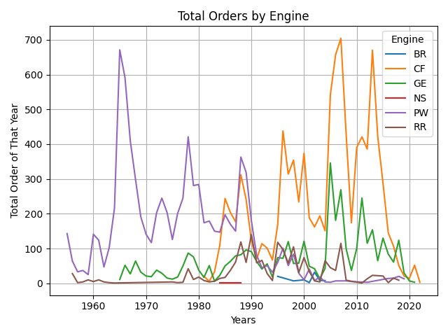

# Boeing Historical Orders & Deliveries Data Analysis

## Project Overview

This project focuses on exploratory data analysis (EDA), data cleaning, statistical summarization, and business-oriented visualization of Boeing’s historical aircraft orders and deliveries using Python and data science libraries.

The primary dataset contains commercial aircraft order records such as customer information, country distribution, delivery years, aircraft model series, engine manufacturers, order totals, and regional market segmentation.

The objective of the project is to:

* preprocess and clean the raw dataset
* identify meaningful patterns in aircraft ordering behavior
* analyze relationships between countries, customers, and aircraft models
* visualize Boeing’s market distribution across multiple dimensions
* evaluate long-term trends in global aviation demand

---

## Dataset

### Source File

`OrdersandDeliveries.csv`

### Main Attributes

The dataset includes the following key variables:

* `Country` → country of the customer
* `Customer Name` → airline/customer placing the order
* `Delivery Year` → year aircraft was delivered
* `Engine` → aircraft engine manufacturer/type
* `Model Series` → Boeing aircraft family/model
* `Order Month` → month the order was placed
* `Order Year` → year the order was placed
* `Region` → geographical business region
* `Delivery Total` → total delivered aircraft
* `Order Total` → total ordered aircraft
* `Unfilled Orders` → remaining undelivered aircraft

---

## Data Preprocessing

Several preprocessing operations were applied to improve data quality and ensure analytical consistency.

### 1. Missing Value Handling

Rows containing null values in the following columns were removed:

* `Delivery Year`
* `Region`

Additionally:

* invalid records where `Country == "All"` were removed since they represent aggregated summary rows
* unnecessary analytical noise was reduced before visualization

---

### 2. Data Type Conversion

The following columns were converted into integer format:

* `Delivery Year`
* `Order Year`
* `Order Total`
* `Delivery Total`

This ensured compatibility with:

* grouping operations
* correlation calculations
* plotting functions
* statistical summaries

---

### 3. Feature Removal

The following column was excluded:

* `Unfilled Orders`

because it was outside the scope of the project and did not directly contribute to the targeted analyses.

---

## Exploratory Data Analysis (EDA)

Descriptive statistics were generated using:

* `head()`
* `describe()`
* `info()`
* `isnull()`
* `value_counts()`
* `groupby()`

This allowed identification of:

* country-based order concentration
* yearly aircraft ordering trends
* regional demand patterns
* aircraft model popularity
* major airline customers
* engine preference evolution
* relationships between delivery and order totals

---

## Visualizations

The following visual outputs were generated during the exploratory data analysis process. Each visualization helps interpret Boeing’s commercial aviation patterns from a different analytical perspective.

---

### 1. Monthly Order Distribution

`monthly_order.png`

This bar chart shows aircraft order distribution across months. It helps identify seasonal procurement behavior and recurring purchasing cycles within the aviation industry.

---

### 2. Yearly Order Trend Analysis

`yearly_order.png`

This line chart presents aircraft ordering behavior across years. Peaks often indicate expansion periods, fleet modernization cycles, or major aviation market booms.

---

### 3. Orders by Country

`order_by_countries.png`

This graph identifies the countries with the highest number of aircraft orders. It highlights Boeing’s strongest geographical markets and strategic demand centers.

---

### 4. Correlation Heatmap

`correlation_heatmap.png`

This heatmap examines statistical relationships between:

* Delivery Year
* Order Year
* Delivery Total
* Order Total

It helps evaluate operational consistency between orders and deliveries.

---

### 5. Orders by Model Series

`orders_by_modelseries.png`

This visualization shows the most frequently ordered Boeing aircraft families. It directly reflects airline fleet preferences and product dominance across market segments.

---

### 6. Orders by Region

`orders_by_regions.png`

This horizontal bar chart presents aircraft demand concentration across global regions. It helps identify Boeing’s strongest regional market penetration.

---

### 7. Total Orders by Country (Volume-Based)

`total_orders_by_countries.png`

Instead of counting rows, this analysis sums total aircraft orders by country. This provides a more realistic business perspective since one row may represent multiple aircraft.

---

### 8. Top USA Airlines by Total Orders

`total_orders_by_US_Airlines.png`

This graph identifies Boeing’s largest airline customers within the United States. It highlights major strategic airline partnerships and revenue-driving customers.

---

### 9. Engine Trend Analysis

`total_orders_by_engine.png`

This multi-line trend analysis shows how aircraft engine preferences changed over time. It reveals technological transitions and long-term supplier dominance patterns.

---

## Additional Analytical Relationships

Multiple visualizations were created using:

* `matplotlib`
* `seaborn`

---

## Relationship Analysis

Additional grouped analyses were performed to investigate deeper relationships between variables.

### Country vs Total Orders

Evaluates which countries generate the highest aircraft order volumes rather than simple row frequency.

---

### Customer vs Strategic Importance

Analyzes which airline customers represent Boeing’s most significant business relationships within the U.S. market.

---

## Business Insights

This project helps identify:

* high-demand aviation regions
* strongest airline customers
* dominant aircraft families
* long-term market behavior
* engine supplier evolution
* operational relationships between orders and deliveries
* global aviation expansion periods

This significantly improves the project by combining statistical analysis with business interpretation and strategic market understanding.

---

## Technologies Used

### Programming Language

* Python

### Libraries

* pandas
* matplotlib
* seaborn
* numpy

### Additional Visualization Support

* business-oriented EDA workflow for aviation market analysis

---

## Project Outcomes

This project demonstrates:

* practical data cleaning
* feature engineering
* exploratory data analysis
* statistical interpretation
* grouped relational analysis
* visualization design
* business intelligence thinking

The combination of customer analysis, country-based demand evaluation, and long-term order trends provides both analytical and strategic understanding of Boeing’s commercial aviation market.

---

## Future Improvements

Potential future extensions include:

* interactive dashboards using Plotly or Tableau
* delivery prediction models
* clustering analysis for customer segmentation
* forecasting aircraft demand trends
* advanced correlation studies
* machine learning models for order prediction

---

## Author

***Elif Asya Tanrıvere***

Computer Engineering Student

Data Analysis Project – Boeing Historical Orders & Deliveries Analysis
